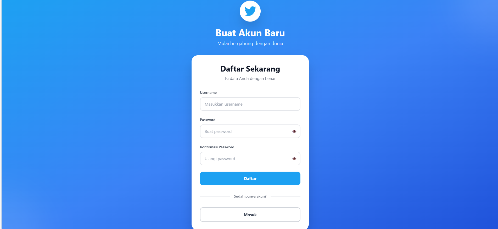
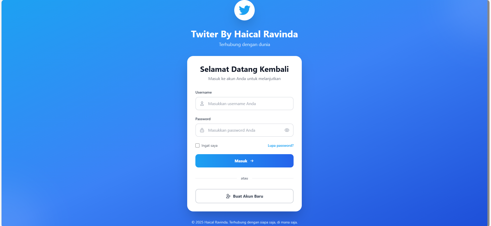
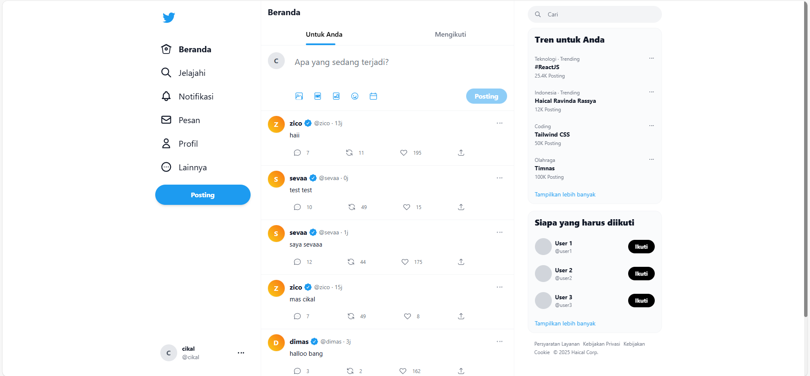

# Frontend React.js + Vite.js + TailwindCSS

<div align="center">

**Platform sosial media modern dengan tampilan menyerupai Twitter**

[Demo](#cara-menggunakan) • [Fitur](#fitur) • [Instalasi](#instalasi-dan-menjalankan-frontend)

</div>

---

## 📋 Tentang Proyek

Frontend ini dibuat menggunakan **React.js**, **Vite.js**, dan **TailwindCSS**, dengan tampilan modern yang terinspirasi dari **Twitter**. Aplikasi ini terhubung ke backend Node.js Express + Prisma + SQLite melalui REST API untuk menyediakan fitur autentikasi, posting, feed, dan interaksi sosial media lainnya.

---

## ✨ Fitur

- 🔐 **Autentikasi User** - Register dan login dengan JWT authentication
- 📰 **Feed Sosial Media** - Menampilkan postingan dari user yang diikuti
- ✍️ **Buat Postingan** - Posting konten baru dengan mudah
- 👥 **Follow System** - Follow dan unfollow user lain
- 📱 **Responsive Design** - Tampilan optimal di desktop dan mobile dengan TailwindCSS
- ⚡ **Fast Performance** - Dibangun dengan Vite untuk pengalaman development yang cepat

---

## 🔧 Persiapan

Pastikan sudah menginstall:

- [Node.js](https://nodejs.org/) v18 atau lebih tinggi
- npm (biasanya sudah termasuk dengan Node.js)
- Git (opsional, untuk clone repository)

**Requirement:**
- Backend Node.js Express + Prisma + SQLite sudah berjalan di `http://localhost:3000/api`

---

## 🚀 Instalasi dan Menjalankan Frontend

### 1. Clone Repository

```bash
git clone <URL_REPOSITORY_FRONTEND>
cd <NAMA_FOLDER>
```

### 2. Install Dependencies

```bash
npm install
```

### 3. Jalankan Development Server

```bash
npm run dev
```

### 4. Akses Aplikasi

Buka browser dan akses frontend di:
```
http://localhost:5173
```

> ⚠️ **Penting:** Pastikan backend sudah berjalan agar frontend dapat berkomunikasi dengan API untuk autentikasi dan feed.

---

## 📱 Cara Menggunakan

### 1️⃣ Register

Buat akun baru melalui halaman register dengan mengisi informasi yang diperlukan.



### 2️⃣ Login

Masuk menggunakan akun yang telah dibuat sebelumnya.



### 3️⃣ Feed Sosial Media

Setelah login, Anda akan diarahkan ke halaman feed yang menampilkan:
- Posting dari user yang Anda ikuti
- Form untuk membuat postingan baru
- Daftar user yang dapat di-follow/unfollow



Semua interaksi akan otomatis tersinkronisasi dengan backend melalui REST API.

---

## 🎨 TailwindCSS

Frontend menggunakan **TailwindCSS** untuk styling dengan pendekatan utility-first. Tampilan modern dan responsif dapat dengan mudah dikustomisasi melalui konfigurasi Tailwind di `tailwind.config.js`.

---

## 📝 Catatan Penting

- ✅ Pastikan backend berjalan sebelum menggunakan frontend
- 🔑 Token JWT disimpan di `localStorage` untuk autentikasi otomatis di setiap request
- 📱 Frontend dirancang responsive dan dapat digunakan di desktop maupun perangkat mobile
- 🔄 Refresh token otomatis untuk menjaga sesi tetap aktif

---

## 🛠️ Tech Stack

| Technology | Purpose |
|------------|---------|
| React.js | UI Library |
| Vite.js | Build Tool & Dev Server |
| TailwindCSS | Utility-First CSS Framework |
| Axios/Fetch | API Communication |
| React Router | Client-Side Routing |

---


## 🤝 Contributing

Kontribusi selalu diterima! Silakan buat pull request atau issue untuk saran dan perbaikan.

---

<div align="center">

**Dibuat dengan ❤️ menggunakan React + Vite + TailwindCSS**

</div>
